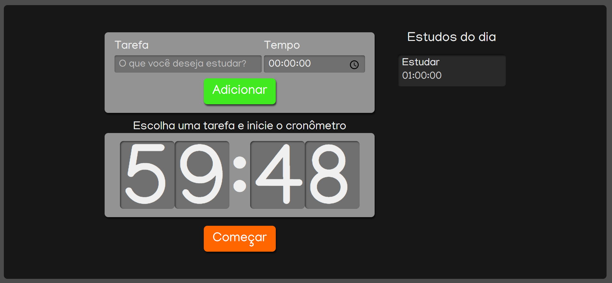

# Contador de Tarefas

  

## Como rodar passpo a passo:
1. Clone o projeto com `git clone https://github.com/prince-neres/task-counter`
2. Entre no diretório do projeto com `ctask-counter`
3. `npm i` ou `yarn`
4. `npm start` ou `yarn start`

## Tecnologias utilizadas:
* [React.js](https://pt-br.reactjs.org/)
* [SASS](https://sass-lang.com/)
